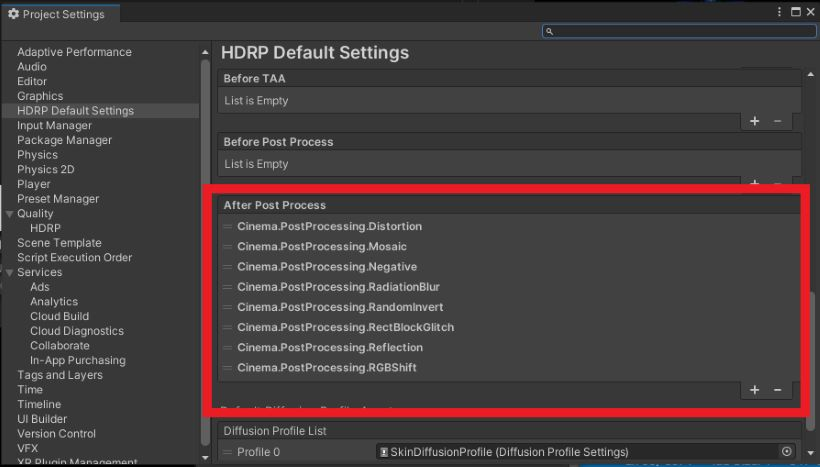

Cinema Paint
====

**Cinema Paint** is a collection of custom abstract paint post-processing effects for Unity's [HDRP](https://docs.unity3d.com/Packages/com.unity.render-pipelines.high-definition@11.0/manual/index.html).

Work in progress..


[HDRP]:
    https://docs.unity3d.com/Packages/com.unity.render-pipelines.high-definition@latest

System Requirements
-------------------

- Unity 2021.1
- HDRP 11.0

Effects
-------

### Radiation Blur

## Demo


## How to install


Write a package path on manifest.json

```
"jp.supertask.cinema-paint.post-processing": "https://github.com/supertask/CinemaPaint.git?path=/Packages/jp.supertask.cinema-paint.post-processing",
```


## How to setup

Define custom post processing orders to make them take effect in the pipeline.




## More effects?

- [Kino](https://github.com/keijiro/Kino)
    - for edge, streak, and more image effects.
- [Cinema](https://github.com/supertask/Cinema)
- 


## Acknowledge

- nobnak, WaterColorFilter, https://github.com/nobnak/WaterColorFilter
