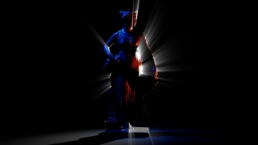
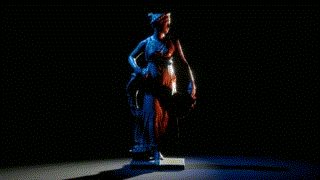

Cinema
====

**Cinema** is a collection of custom post-processing effects for Unity's [High Definition Render Pipeline](https://docs.unity3d.com/Packages/com.unity.render-pipelines.high-definition@11.0/manual/index.html) (HDRP) such as Keijiro's Kino.

Cinema is **HDRP version of kaiware007's shader** which is on the repo, [UnityVJShaderSlide20181108](https://github.com/kaiware007/UnityVJShaderSlide20181108).

[Cienma](https://user-images.githubusercontent.com/5733604/140555914-b6d9b8a5-3fc3-48e4-b8cb-c2d566615cc0.mov)


[HDRP]:
    https://docs.unity3d.com/Packages/com.unity.render-pipelines.high-definition@latest

System Requirements
-------------------

- Unity 2021.1
- HDRP 11.0

Effects
-------

### Radiation Blur


### God ray




### Distortion

Noise distortion & Barrel distortion



### Mosaic


**Mosaic** is .. 

### RGB Shift


### Random invert

### Rect Block Glitch

### Reflection

## Demo

[Combined Cienma](https://user-images.githubusercontent.com/5733604/140559540-9907fc94-453a-4810-b2d8-2436eb66c62e.mov)


## How to install


Write a package path on manifest.json

```
"jp.supertask.cinema.post-processing": "https://github.com/supertask/Cinema.git?path=/Packages/jp.supertask.cinema.post-processing",
```


## How to setup

Define custom post processing orders to make them take effect in the pipeline.


## More effects?

Use [Kino](https://github.com/keijiro/Kino) for edge, streak, and more image effects.

I am planing to add more cinematic image effects in the future.. Check out the list [New Filters](https://github.com/supertask/Cinema/issues/2). And let me know incredible image effects you know.


## Key binders

- F1 key: Mosaic
- F2 key: Radiation Blur
- F3 key: Rect Block Glitch
- F4 key: Noise Distortion
- F5 key: Barrel Distortion
- F6 key: RGB Shift
- F7 key: Random Invert
- F8 key: Reflection (bottom to top)
- F9 key: Reflection (right to left)

## Acknowledge

- kaiware007, UnityVJShaderSlide20181108, https://github.com/kaiware007/UnityVJShaderSlide20181108
	- He is one of the super coders I know.
- XJINE, Unity_ImageFilters, https://github.com/XJINE/Unity_ImageFilters 
- Ian McEwan, Ashima Arts (Simplex noise)
- Stefan Gustavson (Classic noise and others)
