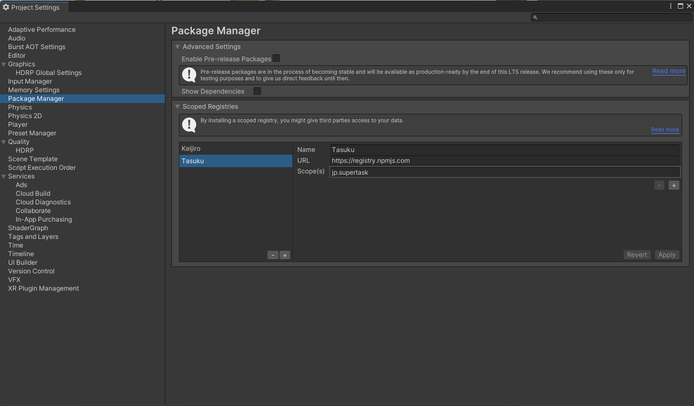
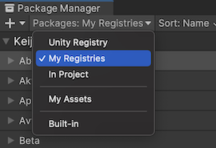
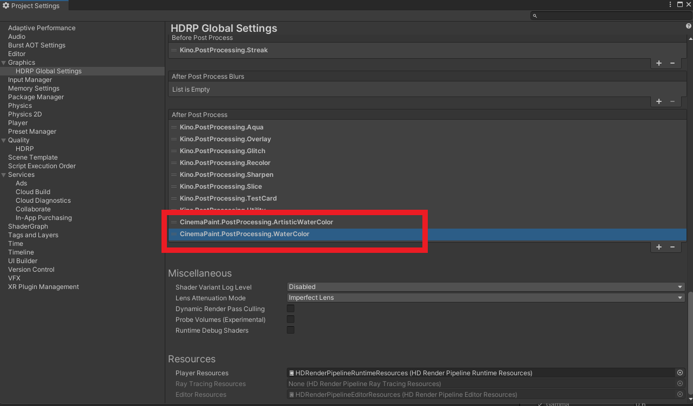

Cinema Paint
====

**Cinema Paint** is a collection of custom abstract paint post-processing effects for Unity's [HDRP](https://docs.unity3d.com/Packages/com.unity.render-pipelines.high-definition@11.0/manual/index.html).

Work in progress...

[HDRP]:
    https://docs.unity3d.com/Packages/com.unity.render-pipelines.high-definition@latest

Tested environment
-------------------

- Unity 2021.1
- HDRP 12.1

Effects
-------

### Simple water color

### Artistic water color

## Demo

https://github.com/TranscendVFX/VFXGraphIntermediate

## How To Install

This package uses the [scoped registry] feature to resolve package
dependencies. Open the Package Manager page in the Project Settings window and
add the following entry to the Scoped Registries list:

- Name: `Tasuku`
- URL: `https://registry.npmjs.com`
- Scope: `jp.supertask`

Now you can install the package from My Registries page in the Package Manager
window.

[scoped registry]: https://docs.unity3d.com/Manual/upm-scoped.html

## How to setup

Define custom post processing orders to make them take effect in the pipeline.

## More effects?

- [Kino](https://github.com/keijiro/Kino)
- [Cinema](https://github.com/supertask/Cinema)

## Acknowledge

- nobnak, WaterColorFilter, https://github.com/nobnak/WaterColorFilter
- t-takasaka, Watercolor Rendering, https://github.com/t-takasaka/UnityPostEffectsLibrary